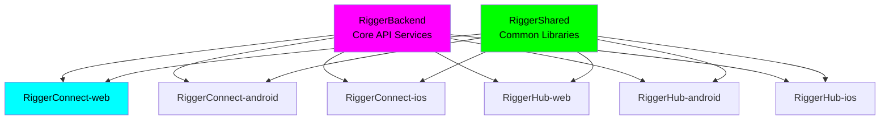

# RiggerShared

<div align="center">

### **A ChaseWhiteRabbit NGO Initiative**
*Shared Libraries and Components for Rigger Ecosystem*

[](https://github.com/tiation/RiggerShared/actions)
[](docs/security/)
[](docs/ethics/)
[](https://www.gnu.org/licenses/gpl-3.0)

```ascii
    🔧 SHARED FOUNDATION FOR ENTERPRISE GRADE 🔧
    ╔════════════════════════════════════════════╗
    ║  CONSISTENCY • EFFICIENCY • MODULARITY                          ║
    ╚════════════════════════════════════════════╝
    📦 COMPONENTS • 🔄 REUSABLE • 🏗️ MODULAR • ⚡ EFFICIENT
```

</div>

## 🎯 Project Overview

RiggerShared houses pivotal shared libraries and components forming the backbone of Rigger's entire ecosystem. These standardized modules optimize resource utilization and simplify consistent functionality across RiggerConnect, RiggerHub, and related platforms.

### 🌟 Key Features
- 🚀 **Modern Architecture** - Built with latest technologies and best practices
- 🔒 **Enterprise Security** - Multi-layer security with encryption and access control
- ⚡ **High Performance** - Optimized for speed and scalability
- 🌟 **Ethical Design** - Privacy-first, bias-free, worker-empowering technology

## 🔗 Related Repositories

### Core Platform Components

| Repository | Platform | Description | GitHub SSH URL |
|------------|----------|-------------|----------------|
| **RiggerBackend** | API | Core backend services and APIs | `git@github.com:tiation/RiggerBackend.git` |
| **RiggerConnect-web** | Web | Professional networking platform | `git@github.com:tiation/RiggerConnect-web.git` |
| **RiggerConnect-android** | Android | Mobile networking app | `git@github.com:tiation/RiggerConnect-android.git` |
| **RiggerConnect-ios** | iOS | Mobile networking app | `git@github.com:tiation/RiggerConnect-ios.git` |
| **RiggerHub-web** | Web | Operations management hub | `git@github.com:tiation/RiggerHub-web.git` |
| **RiggerHub-android** | Android | Mobile operations hub | `git@github.com:tiation/RiggerHub-android.git` |
| **RiggerHub-ios** | iOS | Mobile operations hub | `git@github.com:tiation/RiggerHub-ios.git` |

### Enterprise Integration Architecture



### ChaseWhiteRabbit NGO License Framework

All repositories in the Rigger ecosystem are licensed under **GPL v3**, ensuring:
- ✅ **Open Source Transparency**: Complete code visibility and community auditing
- ✅ **Ethical Technology Standards**: Algorithmic fairness and bias prevention
- ✅ **Worker Empowerment Focus**: Technology serving users, not corporate profits
- ✅ **Community Ownership**: Improvements benefit the entire rigger community
- ✅ **Corporate Responsibility**: Commercial use must remain open and accessible

## 📍 Repository Location & Structure

**Current Location**: `/Users/tiaastor/Github/tiation-repos/RiggerShared/`

This repository is part of the **Tiation Enterprise Repository Structure**, specifically designed to house **ChaseWhiteRabbit NGO's** technology initiatives following enterprise-grade development practices.

### 🏗️ Enterprise Ecosystem
- **Repository Collection**: [Enterprise Repository Index](../ENTERPRISE_REPOSITORY_INDEX.md)
- **Related Projects**: [List related repositories]
- **Infrastructure**: Hosted on Hostinger VPS cluster with enterprise DevOps practices

### 🌟 NGO Integration
As a **ChaseWhiteRabbit NGO Initiative**, this project adheres to:
- ✅ **Enterprise-grade development practices**
- ✅ **Ethical technology standards**
- ✅ **Worker empowerment focus**
- ✅ **DevOps best practices with CI/CD**
- ✅ **Open development transparency**

## 🚀 Technology Stack

| Technology | Version | Purpose |
|------------|---------|------------|
| Node.js, TypeScript | Latest | Core technology stack |
| TypeScript | Latest | Core technology stack |
| ESLint | Latest | Core technology stack |
| Prettier | Latest | Core technology stack |

## ⚡ Quick Start

### Prerequisites
- System requirements as per documentation
- Development tools and dependencies
- Configuration and setup requirements

### Installation

```bash
# Clone the repository
git clone git@github.com:tiation/RiggerShared.git
cd RiggerShared

# Install dependencies
npm install

# Set up environment variables
cp .env.example .env.local
# Edit .env.local with your configuration

# Start development server
npm run dev

# Open browser to http://localhost:3000
```

### Development Workflow

```bash
# Development server with hot reload
npm run dev

# Type checking
npm run type-check

# Linting and formatting
npm run lint
npm run format

# Testing
npm test
npm run test:coverage

# Build for production
npm run build
```

## 🏗️ Architecture Overview

### System Design
Modern, scalable architecture following enterprise best practices

### Core Components
- Core application logic
- User interface components
- Data management layer

### Integration Points
- Database integration
- Authentication system
- API endpoints

## 📚 Documentation

| Resource | Description |
|----------|-------------|
| [🚀 Setup Guide](docs/setup/) | Development environment setup |
| [🏗️ Architecture](docs/architecture/) | System design and patterns |
| [🚀 Deployment](docs/deployment/) | Production deployment guide |
| [🔧 Troubleshooting](docs/troubleshooting/) | Common issues and solutions |
| [⚖️ Ethics Framework](docs/ethics/) | Responsible AI and ethical guidelines |

## 🔄 CI/CD Pipeline

Our enterprise-grade deployment pipeline ensures reliable, automated delivery:

| Environment | Trigger | Deployment Target | Purpose |
|-------------|---------|-------------------|----------|
| **Development** | Pull Request | Development Server | Feature testing and review |
| **Staging** | Merge to `develop` | Staging Environment | Pre-production validation |
| **Production** | Merge to `main` | Production Cluster | Live application deployment |

### Infrastructure Partners
- **Primary CI/CD**: docker.sxc.codes (145.223.22.7)
- **Kubernetes Management**: helm.sxc.codes (145.223.21.248)
- **GitLab CI/CD**: gitlab.sxc.codes (145.223.22.10)
- **Monitoring**: grafana.sxc.codes (153.92.214.1)

## 🔒 Security & Compliance

### Security Features
- **Authentication**: JWT-based authentication with multi-factor support
- **Data Protection**: End-to-end encryption and GDPR compliance
- **Access Control**: Role-based access control (RBAC)
- **Encryption**: AES-256 encryption for data at rest and in transit

### Ethical AI Standards
- **Bias Prevention**: Regular algorithmic auditing
- **Explainable Decisions**: Transparent recommendation logic
- **Human Oversight**: Manual review capabilities
- **Privacy by Design**: Data minimization and user control

## 🧪 Testing & Quality Assurance

```bash
# Run all tests
npm test

# Coverage report
npm run test:coverage

# E2E testing
npm run test:e2e

# Performance testing
npm run test:perf

# Security audit
npm run security:audit
```

### Quality Standards
- **Code Coverage**: 90%+ test coverage
- **Performance**: < 200ms response time, 99.9% uptime
- **Security**: OWASP Top 10 compliance, regular security audits
- **Accessibility**: WCAG 2.1 AA compliant

## 🤝 Contributing

We welcome contributions from the community! Please read our contributing guidelines before submitting pull requests.

### Development Guidelines
1. Follow the [ChaseWhiteRabbit NGO Code of Conduct](docs/CODE_OF_CONDUCT.md)
2. Use the established [coding standards](docs/setup/coding-standards.md)
3. Include tests for all new features
4. Update documentation for changes
5. Ensure accessibility compliance

### Pull Request Process
1. Fork the repository
2. Create a feature branch (`git checkout -b feature/amazing-feature`)
3. Make your changes with proper testing
4. Commit your changes (`git commit -m 'Add amazing feature'`)
5. Push to the branch (`git push origin feature/amazing-feature`)
6. Open a Pull Request with detailed description

### Getting Started with Contributing
- Check out our [Good First Issues](https://github.com/tiation/RiggerShared/labels/good%20first%20issue)
- Read the [Development Setup Guide](docs/setup/)
- Join our [Community Discussions](https://github.com/tiation/RiggerShared/discussions)

## 🌍 Social Impact

Supporting ChaseWhiteRabbit NGO's mission through:
- Professional development through ethical technology
- Worker empowerment and career advancement
- Community building and knowledge sharing
- Ethical AI and bias prevention

## 📞 Support & Contact

### Technical Support
- 📧 **Project Support**: support@chasewhiterabbit.org
- 🔒 **Security Issues**: security@chasewhiterabbit.org
- 📖 **Documentation**: docs@chasewhiterabbit.org
- ⚖️ **Ethics Concerns**: ethics@chasewhiterabbit.org

### ChaseWhiteRabbit NGO
- 🌐 **Website**: [chasewhiterabbit.org](https://chasewhiterabbit.org)
- 📧 **Contact**: info@chasewhiterabbit.org
- 🐦 **Twitter**: [@ChaseWhiteRabbitNGO](https://twitter.com/ChaseWhiteRabbitNGO)

### Development Team
- 🔧 **Technical Lead**: tiatheone@protonmail.com
- 🌐 **Enterprise Inquiries**: garrett@sxc.codes
- 📧 **General Support**: garrett.dillman@gmail.com

#### For Rigger Ecosystem inquiries, contact:
- **Primary Project Contacts**: jackjonas95@gmail.com, tiatheone@protonmail.com

## 📜 License

This project is licensed under the **GNU General Public License v3.0** - see the [LICENSE](LICENSE) file for details.

### Open Source Commitment
As a **ChaseWhiteRabbit NGO** initiative, we believe in:
- **Transparency**: All code is open and auditable
- **Community Ownership**: Improvements benefit the entire community
- **Ethical Technology**: No vendor lock-in or proprietary restrictions
- **Worker Empowerment**: Technology that serves users, not profits

## 🙏 Acknowledgments

- **ChaseWhiteRabbit NGO** - For their vision and partnership in ethical technology
- **Tiation Team** - For technical excellence and innovative solutions
- **Open Source Community** - For the amazing tools and libraries that make this possible
- **Contributors** - Thank you to all who have contributed to this project

## 📈 Project Status

- **Current Version**: Latest
- **Development Status**: Active Development
- **Last Updated**: 2025-07-24
- **Next Milestone**: Feature completion and testing

---

<div align="center">

### 🏗️ **ChaseWhiteRabbit NGO Initiative** 🏗️

**Transforming Lives Through Ethical Technology**

```ascii
🔧 ENTERPRISE GRADE • ETHICAL • STRIKING DESIGN 🔧
```

[](https://chasewhiterabbit.org)
[](docs/)
[](docs/ethics/)
[](docs/deployment/)

### 🌐 **Infrastructure & Hosting**

**Hostinger VPS Cluster** | **Enterprise-Grade DevOps**

- **🐳 Primary CI/CD**: docker.sxc.codes (145.223.22.7)
- **⚓ Helm Manager**: helm.sxc.codes (145.223.21.248) 
- **📊 Monitoring**: grafana.sxc.codes (153.92.214.1)
- **🗄️ Database**: supabase.sxc.codes (93.127.167.157)

---

**🏗️ RiggerShared - ChaseWhiteRabbit NGO Initiative 🏗️**

*Enterprise-grade technology empowering construction industry professionals*

[](https://tiation.github.io/)
[](https://tiation.github.io/)
[](https://tiation.github.io/)

**Ethical • Enterprise • Empowering**

**[Discover More Projects →](https://tiation.github.io/)**

*"Technology should lift up workers, not replace them."*

</div>
